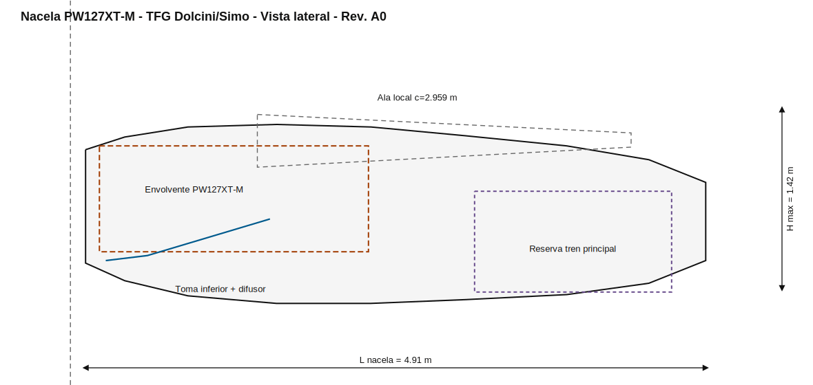
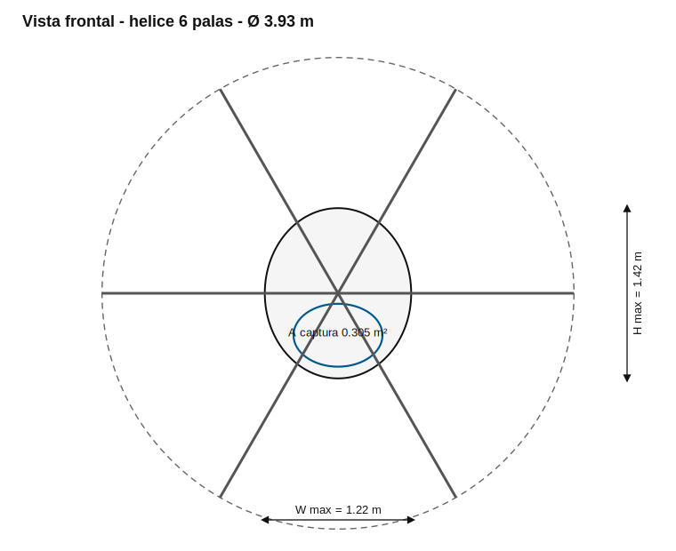
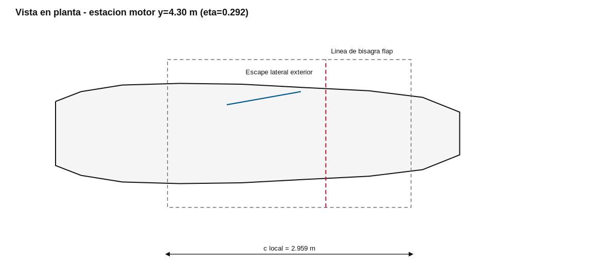

# NACELA — integración paramétrica PW127XT-M

Modelo CAD paramétrico, a escala real, de una nacela para el avión bimotor turbohélice del TFG de Dolcini/Simo. El repositorio integra la envolvente preliminar del motor **Pratt & Whitney Canada PW127XT-M**, una hélice de seis palas, la sección local del ala, la toma inferior, el escape lateral, el mamparo cortafuego, los anclajes y el volumen reservado para el tren principal.

> **Alcance real:** esto no es un juguete ni una carcasa decorativa. Es un modelo de integración preliminar reproducible, con controles geométricos y piezas separadas por función. **Tampoco es una definición aeronavegable**: faltan el installation drawing OEM, caudales y límites térmicos del motor, cargas certificadas, cálculo estructural, CFD, protección contra fuego, drenajes, ventilación y definición de mantenimiento.

## Vista geométrica

| Lateral | Frontal |
|---|---|
|  |  |



## Parámetros principales

| Parámetro | Valor |
|---|---:|
| Motor | PW127XT-M |
| Potencia termodinámica / mecánica publicada | 3360 ESHP / 2750 SHP |
| Régimen máximo de hélice | 1200 rpm |
| Hélice de referencia | Hamilton Sundstrand 568F-1, 6 palas |
| Diámetro de hélice adoptado | 3.93 m |
| Superficie alar | 79.0 m² |
| Envergadura | 29.5 m |
| Estación transversal del motor | y = ±4.30 m, η = 0.292 |
| Cuerda local calculada | 2.959 m |
| Espesor relativo local | 0.141 |
| Longitud total de nacela | 4.91 m |
| Ancho / alto máximos | 1.22 / 1.42 m |
| Área de captura de la toma | 0.305 m² |

Los valores de ala y posición del motor provienen de los Informes Técnicos THR-001/26 a THR-003/26. La configuración motor–hélice se contrasta con el TCDS EASA.A.084 y la ficha oficial de Pratt & Whitney. Las dimensiones externas exactas del **PW127XT-M** no son públicas en el TCDS; por eso la envolvente CAD se declara expresamente como preliminar.

## Qué genera

`src/nacelle_model.py` exporta objetos STEP separados:

- `nacelle_shell`: piel hueca de la nacela.
- `outer_mold_line`: volumen exterior de referencia.
- `intake_duct` e `intake_flowpath`: toma inferior y volumen de flujo.
- `exhaust_duct` y `exhaust_flowpath`: conducto y volumen del escape.
- `engine_envelope`: envolvente reservada para el motor y accesorios.
- `spinner` y `propeller_disk`.
- `wing_reference`: sección NACA 230 interpolada en la estación del motor.
- `gear_bay_envelope`: reserva para el tren principal.
- `forward_engine_mount`, `aft_engine_mount` y `firewall`.
- `nacelle_integration_assembly.step`: conjunto completo.

Los STEP declaran explícitamente metros. Como STL no almacena unidades, los STL se escalan a milímetros para que un visor convencional los importe a tamaño real. Solo se exportan STL para superficies que tiene sentido mallar o visualizar; los volúmenes de referencia no se presentan como piezas fabricables.

## Uso

Requiere Python 3.11 o superior.

```bash
python -m venv .venv
# Windows
.venv\Scripts\activate
# Linux/macOS
source .venv/bin/activate

python -m pip install --upgrade pip
pip install -r requirements-dev.txt

make validate
make drawings
make cad
make test
```

Sin `make`:

```bash
python src/validate_geometry.py
python src/generate_drawings.py
python src/nacelle_model.py
pytest -q
```

Los parámetros se editan únicamente en [`config/nacelle.yaml`](config/nacelle.yaml). No conviene corregir a mano el STEP y después perder la trazabilidad: se modifica el YAML y se regenera.

## Criterio de diseño implementado

La geometría sigue una arquitectura de nacela real de turbohélice regional:

1. Reductor y plano de hélice delante del borde de ataque local.
2. Motor contenido en una envolvente separada de la piel exterior.
3. Toma inferior tipo *chin inlet*, con labio redondeado, garganta y difusor curvo.
4. Mamparo cortafuego detrás del motor.
5. Escape lateral exterior, separado de la toma y del volumen del tren.
6. Carenado posterior prolongado más allá del borde de fuga para alojar el tren y cerrar el flujo.
7. Paneles y módulos independientes para mantenimiento.

La forma exterior no copia a escala una ATR: usa la ATR 42/72 como referencia de arquitectura de integración, pero se ajusta a la cuerda, espesor, estación del motor y dispositivos del ala del TFG.

## Controles automáticos

Antes de crear CAD se bloquea la generación cuando falla alguno de estos controles:

- estación transversal razonable del motor;
- despeje radial entre motor y piel;
- separación radial hélice–nacela;
- coherencia entre el área declarada y el labio de toma;
- relación de áreas del conducto;
- separación entre motor, mamparo cortafuego y volumen del tren;
- extensión de la nacela hasta después del borde de fuga local.

El CI de GitHub ejecuta validación, pruebas, generación de dibujos y exportación STEP/STL. Los archivos CAD generados se publican como artefacto de cada ejecución; no se versionan binarios pesados en el repositorio.

## Documentación

- [Base de diseño y trazabilidad](docs/design_basis.md)
- [Sistema de coordenadas](docs/coordinate_system.md)
- [Plan de verificación pendiente](docs/verification_plan.md)

## Fuentes principales

- EASA, **TCDS EASA.A.084 — ATR 42/ATR 72**, Issue 14, 23-02-2026.
- Pratt & Whitney, **PW127XT Engine Series**.
- Pratt & Whitney, **PW100/150 Engines**, datos dimensionales públicos de la familia PW127.
- Roskam, *Airplane Design*, Part II y Part III, integración del sistema propulsor.
- Informes Técnicos del TFG THR-001/26, THR-002/26 y THR-003/26.

## Advertencia de ingeniería

Una nacela de vuelo no se valida porque “se vea como una de verdad”. El OML actual es una hipótesis geométrica útil para el Capítulo 4 y para preparar CAD/CFD. No debe congelarse para fabricación hasta cerrar, como mínimo, los datos OEM, distorsión y recuperación de presión de la toma, mapa de velocidades internas, temperaturas del escape, cargas de motor/hélice, bird strike, fire zone, drenajes, accesos y retracción real del tren.
